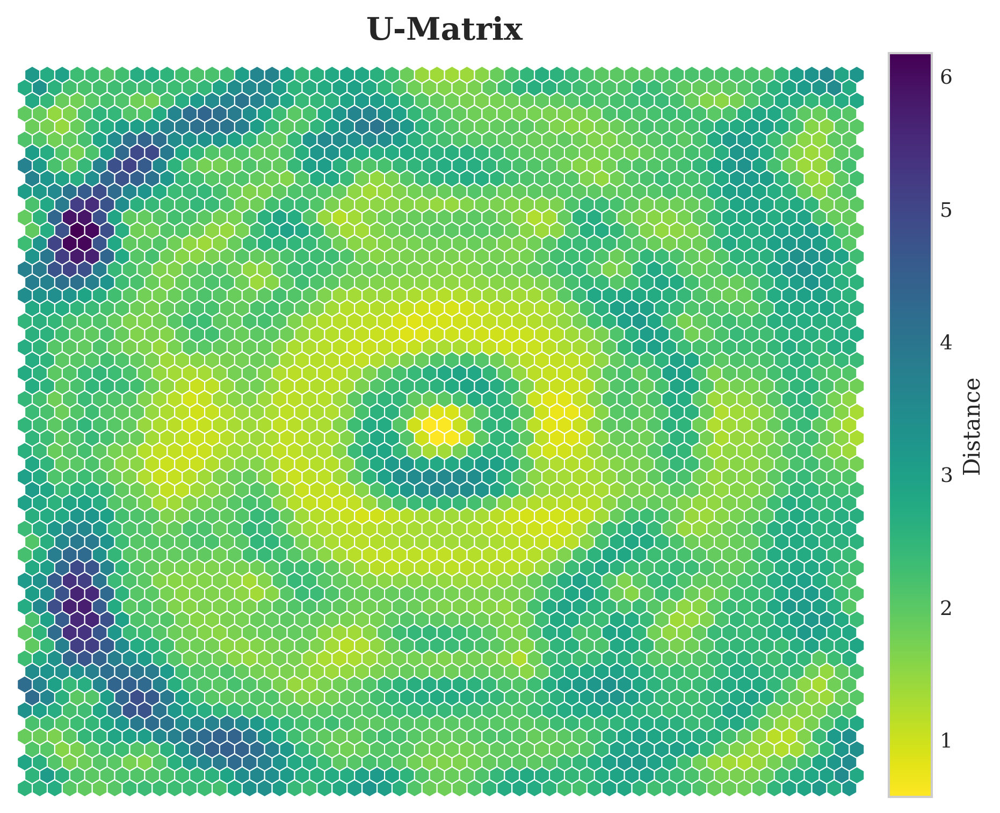
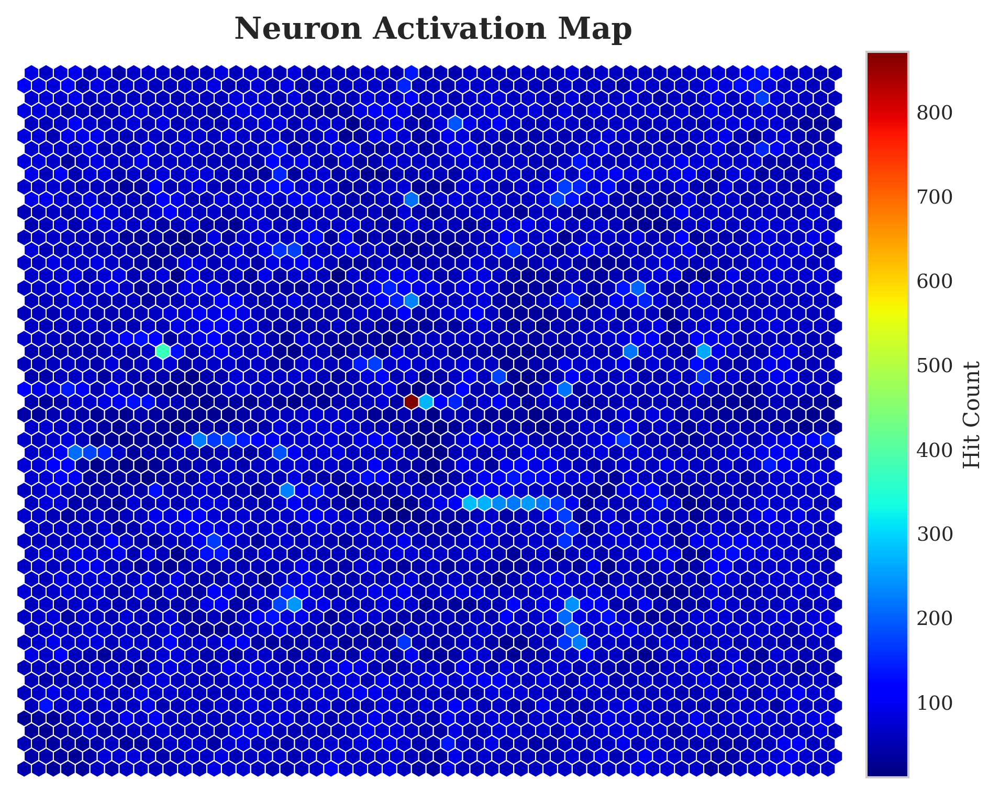

# SOM-based Anomaly Detection

[](https://opensource.org/licenses/MIT)
[](https://www.python.org/downloads/)

This repository contains a feature-based anomaly detection framework that leverages **Self-Organizing Maps (SOM)** to model the distribution of normal data in high-dimensional feature spaces. By utilizing pre-trained deep learning backbones for feature extraction and SOMs for density estimation, SOS provides robust and interpretable anomaly localization.

---

## 🚀 Key Features

- **Backbone Flexibility**: Support for state-of-the-art architectures via `timm` (default: ConvNeXt-V2 Nano).
- **SOM Modeling**: Efficiently clusters high-dimensional features into a 2D grid, capturing the topological structure of nominal data.
- **Anomaly Scoring**: Computes anomaly maps using Mahalanobis-like distances to SOM neurons, refined with Gaussian smoothing.
- **Explainability**: Visualizes the feature space via U-Matrices and Activation Maps.
- **MVTec AD Benchmark**: Full support for the MVTec Anomaly Detection dataset across all 15 categories.

---

## 📊 Qualitative Results

Below are examples of anomaly localization on the MVTec dataset. The model generates high-resolution heatmaps and contours identifying defects.

### Anomaly Localization Examples
| Category | Input & Ground Truth & Anomaly Map |
| :--- | :---: |
| **Bottle** | 
| **Metal Nut** | 

### SOM Diagnostics (Bottle Category)
The Self-Organizing Map provides insights into the learned feature distribution.

| U-Matrix | Activation Map |
| :---: | :---: |
|  |  |
| *Unified Distance Matrix showing clusters* | *Frequency of neuron hits during training* |

---

## 🛠 Usage Instructions

### 1. Requirements
Ensure you have the following dependencies installed:
```bash
pip install torch torchvision timm numpy minisom tqdm matplotlib scipy scikit-image opencv-python
```

### 2. Training and Inference
To run the full pipeline on all MVTec categories:
```bash
python train.py --data_dir /path/to/mvtec --out_dir ./results
```

**Common Arguments:**
- `--backbone`: Name of the feature extractor (e.g., `convnextv2_nano.fcmae_ft_in22k_in1k`).
- `--som_iterations`: Number of training steps for the SOM.
- `--img_size`: Input resolution (default: 224).
- `--k`: Number of nearest neurons for anomaly scoring.

---

## 📝 Paper Preview

Theoretical details, architecture diagrams, and comprehensive benchmark results are available in the accompanying paper:

📄 **[Read the Paper: SOM-based Anomaly Detection](paper/main.pdf)**

*The paper discusses the mathematical foundation of the Mahalanobis scoring on SOM grids and compares the performance against industry standards like PatchCore and PaDiM.*

---

## 📂 Project Structure

- `src/`: Core implementation (SOM logic, feature extraction, metrics).
- `train.py`: Entry point for running experiments.
- `results/`: Directory for saved plots and JSON metrics.
- `paper/`: LaTeX source and compiled PDF for the research paper.

---

## 📜 License
This project is licensed under the MIT License - see the [license.txt](mvtec_anomaly_detection/license.txt) for details.
